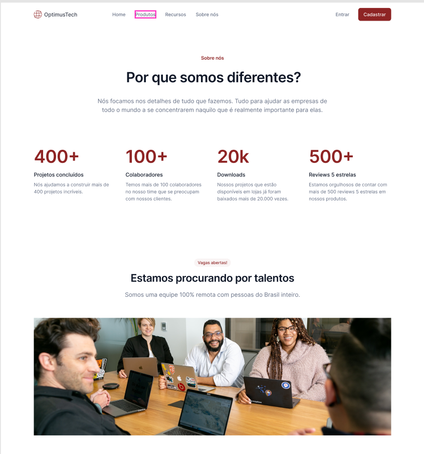

# Contrataçõoes

Uma empresa de TI quer desenvolver uma página destinada a novas contratações e contratou você para desenvolvê-la.

Para isso, te enviaram um layout no Figma. E a partir desse protótipo, o objetivo é transformá-lo em código e dar vida real ao projeto.

## Índice

* [Visão Geral](#visão-geral)
* [Funcionalidades](#funcionalidades)
* [Tecnologias Utilizadas](#tecnologias-utilizadas)
* [Layout](#layout)
* [Como Usar](#como-usar)

---

## Visão Geral

Este é um projeto de uma aplicação web que permite qualquer pessoa possa acessar e visualizar as vagas disponibilizadas na página.

## Funcionalidades

Abaixo as principais funcionalidades ou características do projeto.

* Visualizar as informções da empresa;
* Visualizar as vagas de emprego;
* Permitir informar o e-mail para receber as oportunidades.

## Tecnologias Utilizadas

Abaixo as principais tecnologias que está sendo utilizada para construir este projeto.

* **Linguagens**: [HTML, CSS] (Mesmo nao sendo linguagem e sim marcação de texto)
* **Ferramentas**: [Git, Figma]
* **Link do Repositório**: [https://github.com/denisiorodrigues/contratacoes-lading-page.git](https://github.com/denisiorodrigues/contratacoes-lading-page.git)

## Layout

### Desktop



[Figma do projeto](https://www.figma.com/design/mm3MLozvUDGhDRTxSLlGL5/7daysOfCode-HTML-CSS?node-id=0-1&p=f&t=mHlUzPcnfhwNM5Ly-0)

## Como Usar

1.  **Clone o repositório:**
    ```bash
    git clone https://github.com/denisiorodrigues/contratacoes-lading-page.git
    ```
2.  **Navegue até a pasta do projeto:**
    ```bash
    cd apperia
    ```
3. **Execute a aplicação:**

    Instalar a extenção **Live Server** no VS Code ou clicar no arquivo index.html 
